# 论文图表 Mermaid 代码（图2-1 到 图5-3，V2 重制版）

本版设计目标：

1. 学术风格：黑白灰+轻蓝点缀，不花哨。
2. 版面均衡：避免“又长又扁”，优先接近 4:3。
3. 标注清晰：中文业务语义 + 英文技术标识。

## 全局导出建议

1. 优先导出 `SVG`，保证 Word 放大不糊。
2. 常规图导出为 `1600x1200`。
3. 时序图导出为 `1800x1200`。
4. ER 图导出为 `1700x1200`。
5. 图题统一格式：`图X-X 名称`，置于图下。

---

## 图2-1 后端分层与调用关系图（1600x1200）

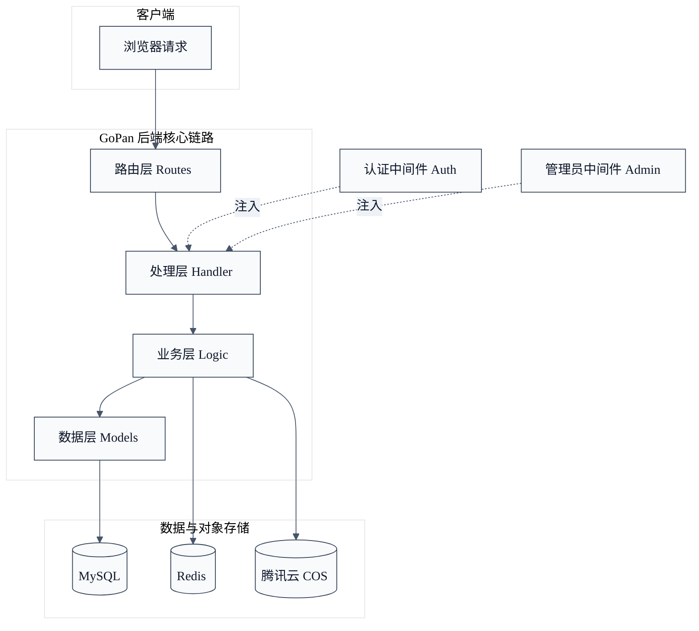

## 图2-2 双令牌续签时序图（1800x1200）

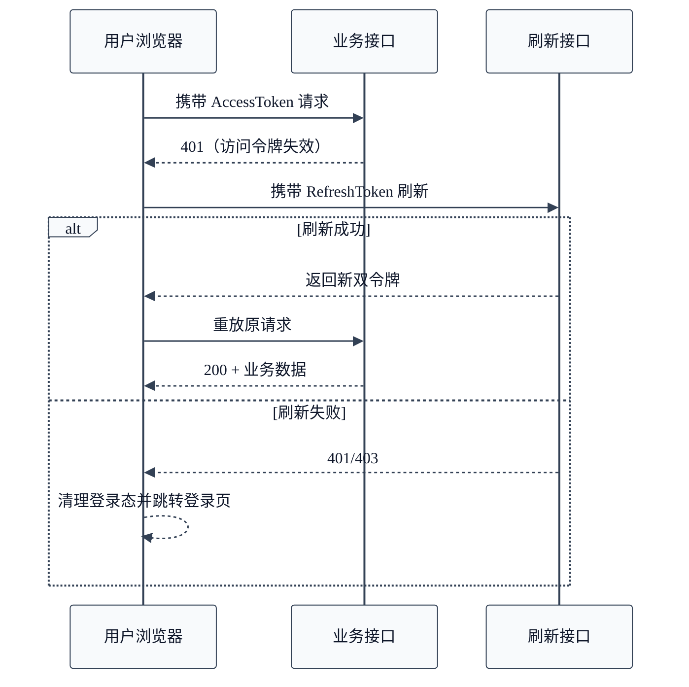

## 图2-3 对象存储与元数据解耦示意图（1600x1200）

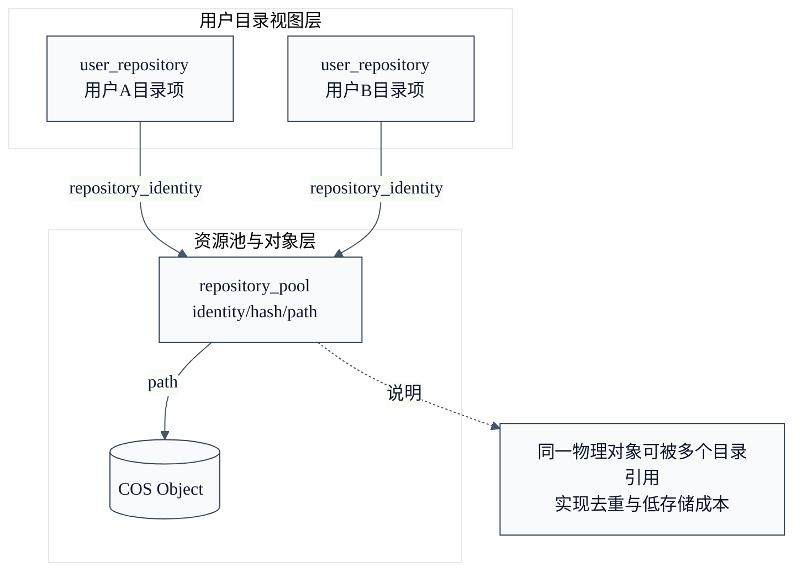

## 图3-1 系统总体用例图（1600x1200）

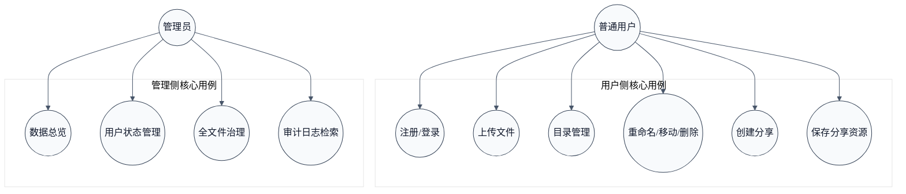

## 图3-2 数据流图（DFD）（1600x1200）

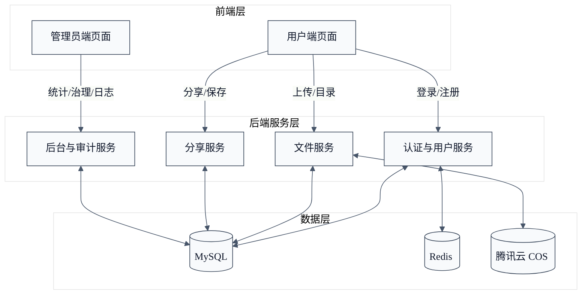

## 图3-3 普通用户用例图（1600x1200）

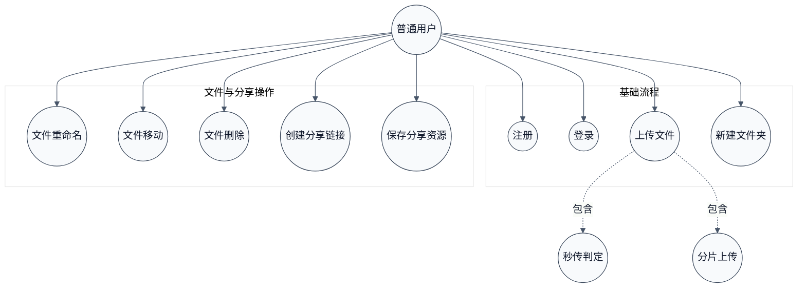

## 图3-4 管理员用例图（1600x1200）

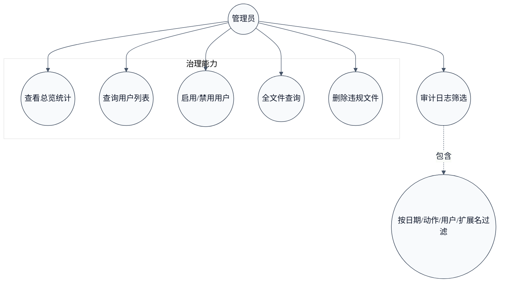

## 图4-1 系统分层架构图（1600x1200）

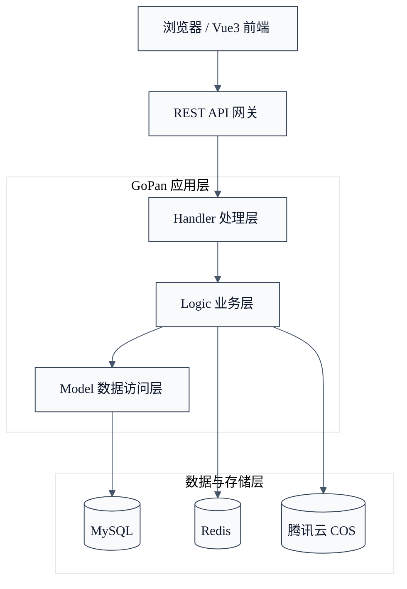

## 图4-2 数据库 E-R 图（1700x1200）

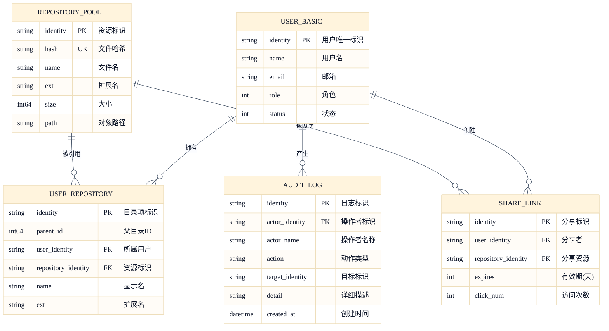

## 图5-1 登录时序图（1800x1200）

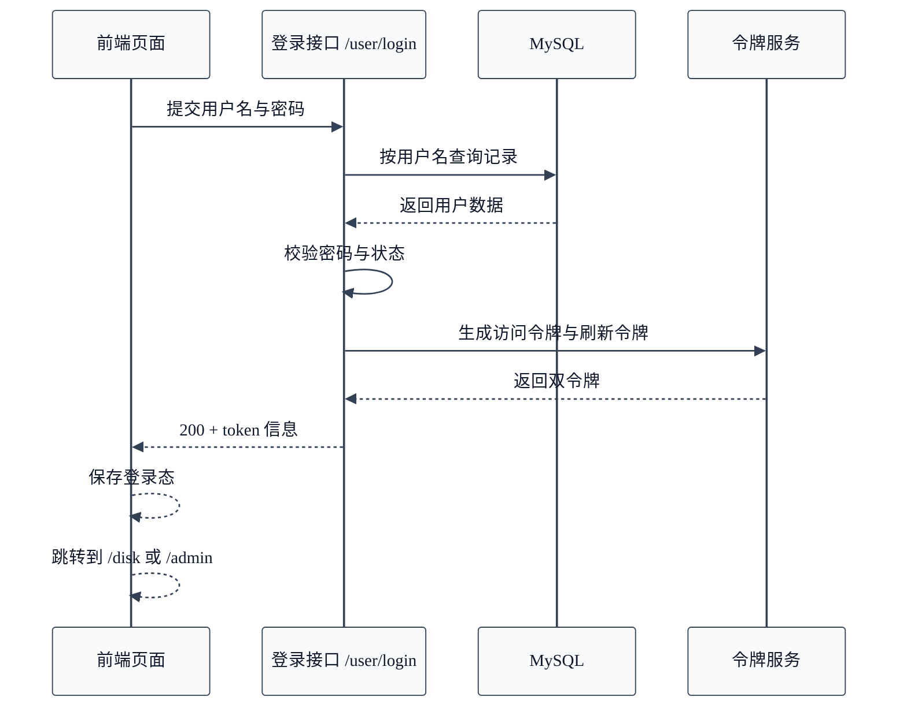

## 图5-2 文件上传流程图（紧凑版，1600x1200）

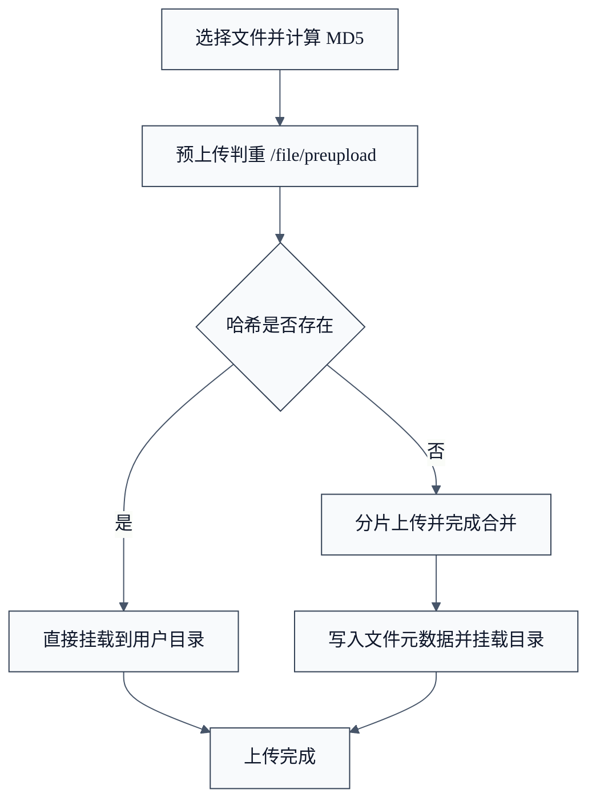

## 图5-3 分享保存流程图（紧凑版，1600x1200）

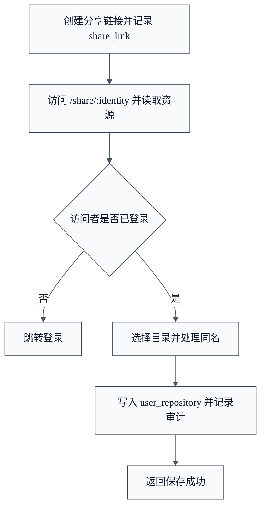

---

## 最终观感优化建议（Word）

1. 所有图统一宽度：页面宽度的 84%。
2. 图前后段距统一：段前 8pt，段后 10pt。
3. 图题字体：宋体小五，居中。
4. 图与图之间至少空 1 行，避免拥挤。
5. 不要混用彩色截图与黑白流程图，可统一加浅灰边框。
